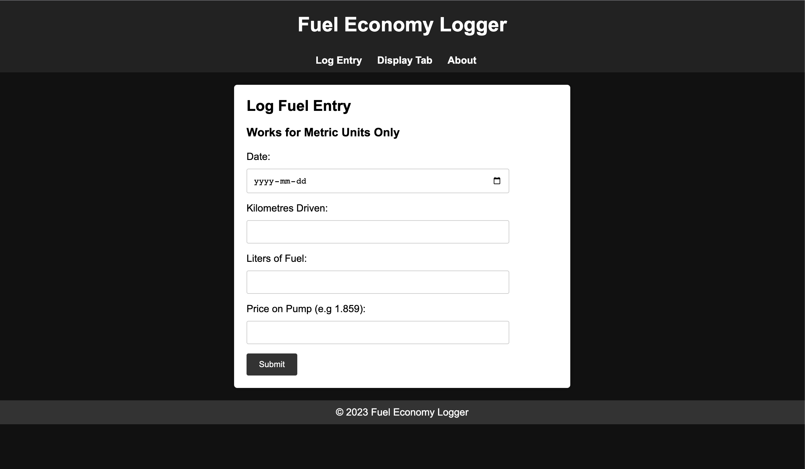
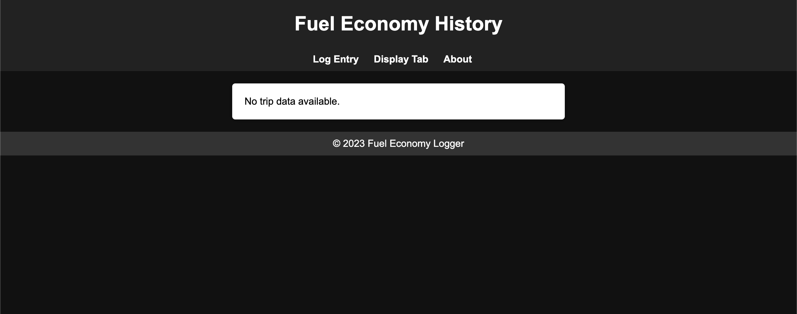
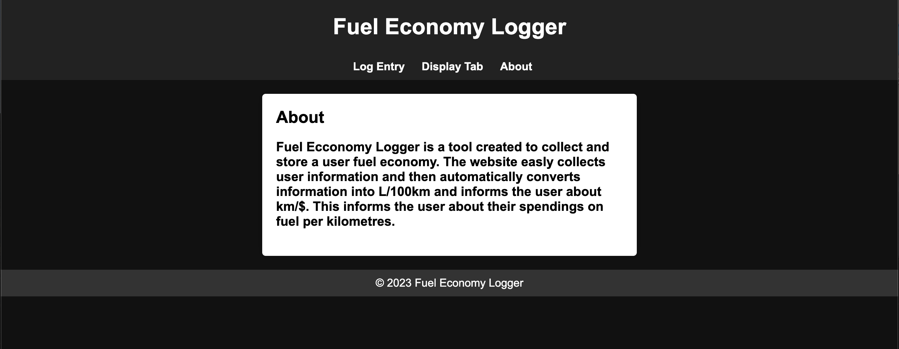
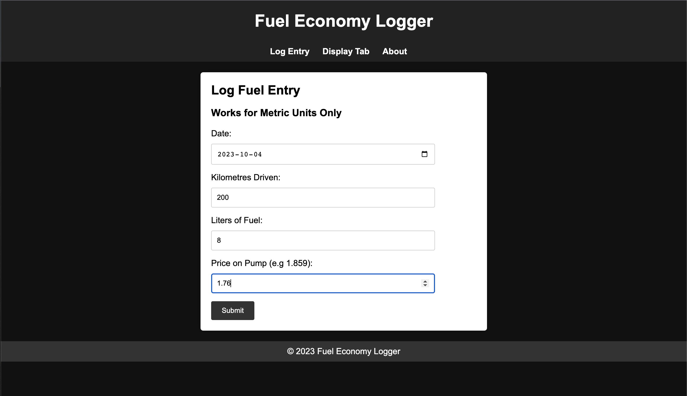
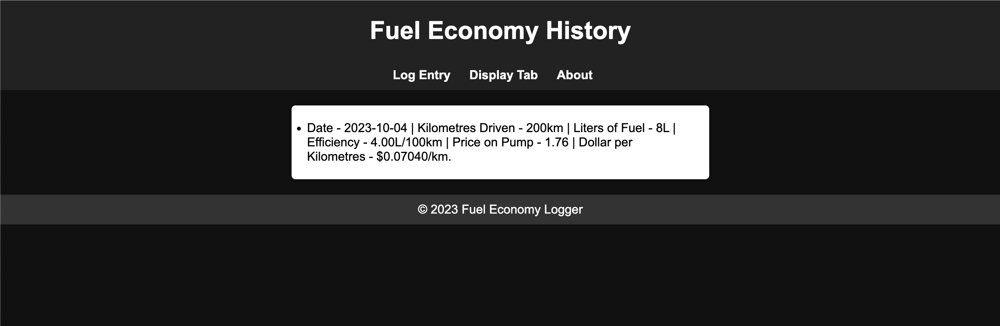

# Fuel-Economy-Logger

## About
This website was create to track fuel expenses per communite to school and back. Since I communite to school(waterloo) during the weekdays, I have driven 
thousands' of kilometres. In order to track my monthly expenses, and to inform me about how much I am spending on fuel. This website give's me a break down of all
the information I would need. 

## Web Based Application
The website, has been designed for users that have set their computer's primary theme to Dark. The code for this website has mainly been done in, HTML with imbedded
Javascript. While using CSS for the styles and web-page visuals. 

## Website Layout:

### Home Page:

### Trip Display:

### About:

## Page in Use:

### User Input:

### Results:
